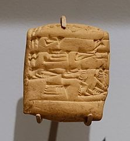

# ur3-viz: Data mining and visualization of Ur III sumerian administrative texts

This repository contains various projects to analyze and visualize on a large scale the transactional data from the corpus of Ur III administrative texts.

The 3rd dynasty of Ur is characterized by an abundant administrative documentation, giving insights about the organization of its society.
About 65,000 cuneiform tablets are known, which record various types of transactions.

The texts of the tablets exhibit repeatable patterns, which makes it an interesting, though challenging, task for a data science project.

## Transactional network

This project currently aims at identifying two-parties transactions, and building the corresponding transactional network.
In addition, since the year can often be identified in the texts, one obtains a time-varying graph.
The current visualization approach gives control over the year, and dynamically updates the graph as it is changed.

The most recent data visualization can be [accessed here](https://alexpof.github.io/ur3-viz/index.html)

The current limitations of this project are as follows.

* Only tablets for which the year is well identified are considered.
* Transactions with more than one 'sender', or more than one 'receiver', are currently not considered
* Intermediaries (identified by the sumerian keyword 'giri₃') are not considered
* The type of goods described in the text is not automatically identified.
However, the current visualization allows to search for specific sub-text in the raw tablets, and highlights the corresponding transactions.
* Not all PNs, or other administrative functions, are properly identified. In particular, the description of PNs as 'son of' another PN (in sumerian, 'PN dumu PN') is not correctly implemented.

In addition to fixing the above limitations, the next steps may include deeper analyses of the time-varying transactional network.

## Transactional flows

This project aims at visualizing the flows of various goods between the different actors during the Ur III period.
The current visualization shows a chord diagram indicating the cumulative directed flows during the selected period, for the selected goods.
In case multiple merchandises are selected, their total flow are summed. For example, it thus allows to analyze the total cattle flows as sum of 'ab₂' (cow), 'gu₄' (ox), etc. (it would be irrelevant, on the other side, to sum 'gu₄' (ox) and 'še' (barley)).
Units of flows are the natural implicit units found in the tablets: head counts for cattle, 'sila₃' for cereals, etc.

The most recent data visualization can be [accessed here](https://alexpof.github.io/ur3-viz/transaction_flow_chord.html)

The current limitations of this project are as follows.

* Only tablets for which the year is well identified are considered.
* Transactions with more than one 'sender', or more than one 'receiver', are currently not considered
* Not all PNs, or other administrative functions, are properly identified. In particular, the description of PNs as 'son of' another PN (in sumerian, 'PN dumu PN') is not correctly implemented.
* Additional goods (such as ).
